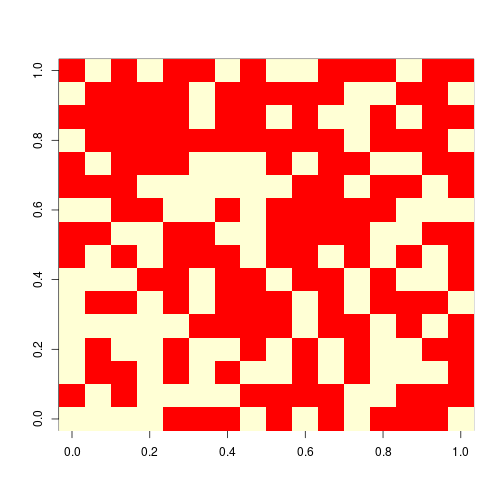
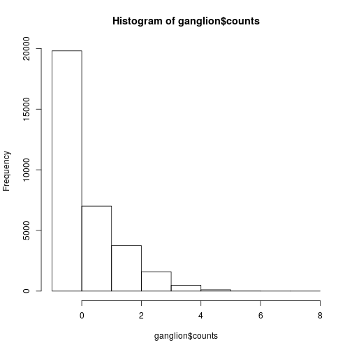
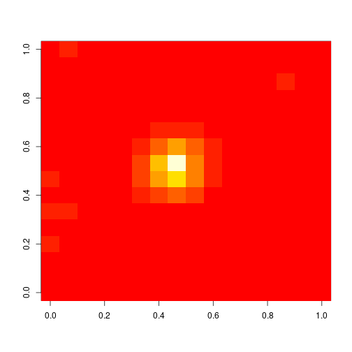

Programming
========================================================
author: Hamed Seyed-allaei
date: 
autosize: true

Algorithm
=========


Control Flow
============

* if
* for
* while
* repeat
* break
* next

if
===

```r
x = 1

if(x>0){
  print("Positive")
} else{
  print("negative")
}
```

```
[1] "Positive"
```


```r
x = -1

if(x>0){
  print("Positive")
} else{
  print("negative")
}
```

```
[1] "negative"
```

Loops
=====

```r
for(i in 1:2){
  print(i)
}
```

```
[1] 1
[1] 2
```


```r
i = 2
while(i>0){
  i=i-1
  print(i)
}
```

```
[1] 1
[1] 0
```

Loops
=====

```r
i = 2
repeat{
  i=i-1
  print(i)
  if(i<0){
    break
  }
  
}
```

```
[1] 1
[1] 0
[1] -1
```

Loops
=====

```r
for(i in 1:5){
  if(i==3){
    next
  }
  print(i)
}
```

```
[1] 1
[1] 2
[1] 4
[1] 5
```

Loops can kill!
===============
*Q. How did the programmer die in the shower?*

*A. He read the shampoo bottle instructions: Lather. Rinse. Repeat.*

Fibonacci
==========


$$F_{n}=F_{n-1}+F_{n-2}$$

$$F_{1}=1,\;F_{2}=1$$

exercise 
========
**Produce 10th number in Fibonacci series, using for loop.**

Function
========

```r
same = function(x,y) {
  b = x==y
  return(b)
}

same(3,2)
```

```
[1] FALSE
```

```r
same(2,2)
```

```
[1] TRUE
```


Exercise 
========
**Produce 10th number in Fibonacci series, using recursion.**

```r
fib = function(n){
  f=0
  if(n<3){
    return(1)
  }
  # add one line of code here!
  return(f)  
}

fib(8)
```

```
[1] 0
```

Spike-Triggered Average
=======================


Retinal ganglion cell
=====================


Install and load R.matlab
=========================

```r
#install.packages("R.matlab")
library(R.matlab)
```
Load data
=========

```r
ganglion = readMat("ganglion.mat")
summary(ganglion)
```

```
       Length  Class  Mode   
counts   32767 -none- numeric
stim   8388352 -none- numeric
```

```r
dim(ganglion$counts)
```

```
[1] 32767     1
```

```r
dim(ganglion$stim)
```

```
[1]    16    16 32767
```

Stimuli 
============

```r
image(ganglion$stim[,,3])
```



Spike counts
============

```r
hist(ganglion$counts, breaks = -1:8)
```



Spike-Triggered Average
=======================

$${\mathrm  {STA}}={\tfrac  {1}{n_{{sp}}}}\sum _{{i=1}}^{T}y_{i}{\mathbf  {x_{i}}},$$

${\mathbf  {x_{i}}}$: Stimulus $i$. 

$y_i$: Spike count.

Spike-Triggered Average
================

```r
s = ganglion$stim[,,1] * 0 
for(j in 1:(length(ganglion$counts)-i)){
  s = s + ganglion$stim[,,j]*ganglion$counts[j]
}
n = sum(ganglion$counts)
s = s/n
```

Spike-Triggered Average
=======================


Just one line!
==============

```r
image(apply(ganglion$stim, c(1,2), weighted.mean, ganglion$counts))
```


Just one line!
==============

```r
start_time = proc.time()

m = apply(ganglion$stim, c(1,2), weighted.mean, ganglion$counts)

proc.time() - start_time
```

```
   user  system elapsed 
  0.620   0.048   0.669 
```


And in Parralel
==============

```r
library(parallel)

no_cores <- detectCores()
cl <- makeCluster(no_cores)

start_time <- proc.time()

m = parApply(cl,ganglion$stim, c(1,2), weighted.mean, ganglion$counts)

proc.time() - start_time
```

```
   user  system elapsed 
  0.580   0.032   0.877 
```

```r
stopCluster(cl)
```
