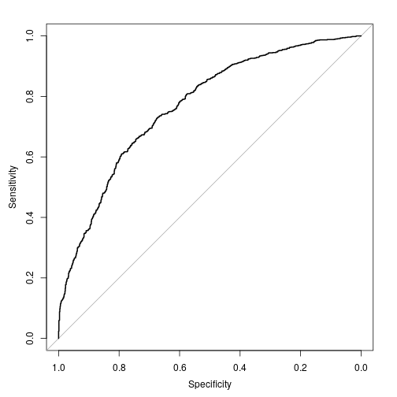

Signal Detection Theory
========================================================
author: Hamed Seyed-allaei
date: 
autosize: true


Down Syndrome
==============


Diagnosis
=============
Nuchal Translucency


Amniotic Fluid Test
====================


Decision?
====================

$$X > X_{th}$$

The boundaries are not clear
============================


History
=======
 


Sensitivity index
============================
$$d'={\frac {\mu _{S}-\mu _{N}}{\sqrt {{\frac {1}{2}}(\sigma _{S}^{2}+\sigma _{N}^{2})}}}$$
d=0 is bad.
d=1 acceptable.
d=6 very good.

Receiver operating characteristic (ROC)
=======================================


Receiver operating characteristic (ROC)
=======================================
We load the package, we take 2 populations.

```r
library(pROC)
x1 = rlnorm(1000, meanlog = 0.5, sdlog = 1)
x2 = rlnorm(1000, meanlog =  1.5, sdlog = 1)
df = data.frame(res=c(rep(0,length(x1)),rep(1,length(x2))), 
                pred=c(x1,x2))
```

Receiver operating characteristic (ROC)
=======================================


Receiver operating characteristic (ROC)
=======================================

```r
roc(df$res, df$pred, plot = F)
```

```

Call:
roc.default(response = df$res, predictor = df$pred, plot = F)

Data: df$pred in 1000 controls (df$res 0) < 1000 cases (df$res 1).
Area under the curve: 0.7678
```

Performance of clasisfiers
=========================

The classifier gives us the probability, 
we should choose the treshold. 


Comparing tests
=======================================

```r
m = 10000
t_test1 = numeric(m)
wil_test1 = numeric(m)

t_test2 = numeric(m)
wil_test2 = numeric(m)

for(i in 1:m){
  x1 = rnorm(6, mean = 0, sd = 1)
  x2 = rnorm(6, mean = 1, sd = 1)
  
  t_test1[i]   = t.test(x1)$p.value
  wil_test1[i] = wilcox.test(x1)$p.value

  t_test2[i]   = t.test(x2)$p.value
  wil_test2[i] = wilcox.test(x2)$p.value
}
```


Comparing tests
=======================================

```r
roc(c(rep(0,m), rep(1,m)), c(t_test1,t_test2), plot = F)
```

```

Call:
roc.default(response = c(rep(0, m), rep(1, m)), predictor = c(t_test1,     t_test2), plot = F)

Data: c(t_test1, t_test2) in 10000 controls (c(rep(0, m), rep(1, m)) 0) > 10000 cases (c(rep(0, m), rep(1, m)) 1).
Area under the curve: 0.8849
```

```r
roc(c(rep(0,m), rep(1,m)), c(wil_test1,wil_test2), plot = F)
```

```

Call:
roc.default(response = c(rep(0, m), rep(1, m)), predictor = c(wil_test1,     wil_test2), plot = F)

Data: c(wil_test1, wil_test2) in 10000 controls (c(rep(0, m), rep(1, m)) 0) > 10000 cases (c(rep(0, m), rep(1, m)) 1).
Area under the curve: 0.8732
```


Comparing tests
=======================================

