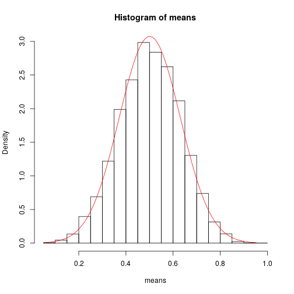
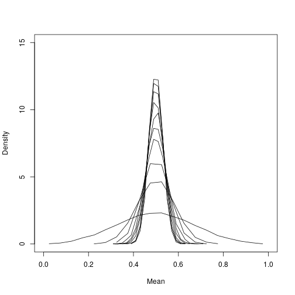
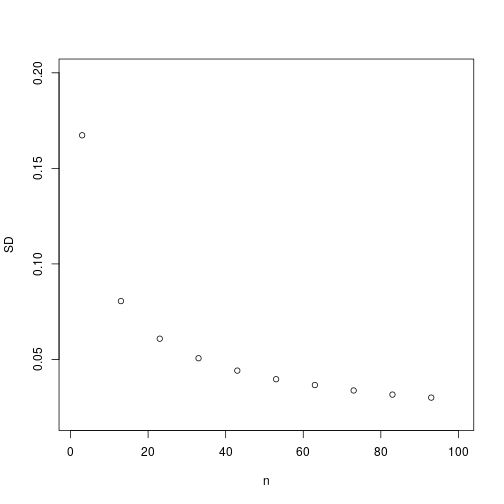
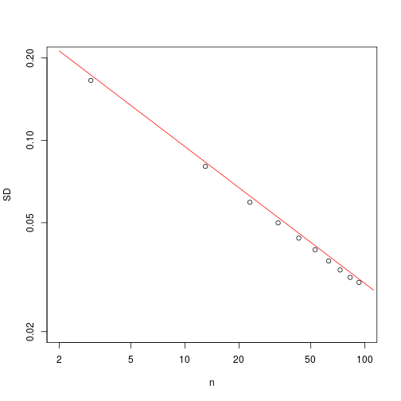

Standard Error
========================================================
author: Hamed Seyed-allaei
date: 
autosize: true

Simulating reality
========================================================

We simulate a hypothetical experiment. 
The result of the experiment are some random numbers, uniformly distributed between 0 and 1.

We calculate the mean of this variable. Now this is the question:

**How much error we will have depending on the sample size?**

You have seen the math already, but let see it in practice. 

*The choice of a non-normal distribution is deliberate.*


Lets take some random numbers
=============================
Lets take 5 numbers and calculate their mean:

```r
r = runif(5,min=0,max=1)
mean(r)
```

```
[1] 0.4322367
```
Lets do it for 50 numbers:

```r
r = runif(50,min=0,max=1)
mean(r)
```

```
[1] 0.5245183
```
The true mean is 0.5. Which one is closer?

If we repeat the experiment
===========================
Lets repeat the experiment of 5 measurements 1000 times:

```r
n=5 # The measurments in an experiment. 
m=10000 # Repeatition of the experiment. 
means=numeric(m) # We store means here. 
for(i in 1:m){ # start of loop
    means[i] = mean(runif(n,min=0,max=1)) #The experiment.
} # end of loop
```

Histogram of menas
==================


The distribution depends on sample size
=======================================



Standard deviation of means
===========================


Log-log plot
===========================


Conclusion
==========
If you repeat an experiments, the standard deviation of means ($\sigma_N$) is:

$$\sigma_N \approx \frac{\sigma}{\sqrt{N}}$$
$\sigma$ is the standard deviation of the original distribution (here it was uniform), not the means (which was normal).

**That is central limit theorem!**


Standard Error
==============
$$SE = \frac{\sigma}{\sqrt{N}}$$


Change the distribution from uniform to anything else
=====================================================
and see if you can break this.
