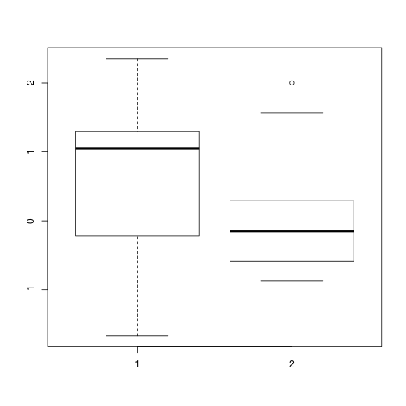

t-test
========================================================
author: Hamed Seyed-allaei
date: 
autosize: true

We have 2 population
========================================================


```r
mu1 = 0
mu2 = 0
sd1 = 1
sd2 = 1
```

We take some random samples
========================================================

```r
x1 = rnorm(10, mean = mu1, sd=sd1)
x2 = rnorm(10, mean = mu2, sd=sd2)
```

Box plot will be
================

```r
boxplot(x1,x2)
```



Are the means equal?
================

$$ \mu_1 = \mu_2$$

$$ \mu_1 \ne \mu_2$$


```r
mean(x1)
```

```
[1] 0.6022029
```

```r
mean(x2)
```

```
[1] 0.1211672
```
*In respect to what?*

t
================
We define $t$ as
$$t =  \frac{\mu_1 - \mu_2}{SE_{\mu_1 - \mu_2}}$$

Now the problem is how to calculate $SE_{\mu_1 - \mu_2}$.

If $C = A - B$ and $A$ and $B$ are independent, then $\sigma_C^2 = \sigma_A^2 + \sigma_B^2$; therefore, 
$$SE_{\mu_1-\mu_2} = \sqrt{(\frac{\sigma_1^2}{N_1} + \frac{\sigma_2^2}{N_2})}$$


t-test
======

```r
t.test(x1,x2)
```

```

	Welch Two Sample t-test

data:  x1 and x2
t = 0.91546, df = 16.236, p-value = 0.3733
alternative hypothesis: true difference in means is not equal to 0
95 percent confidence interval:
 -0.6315643  1.5936356
sample estimates:
mean of x mean of y 
0.6022029 0.1211672 
```

t-test
======

```r
mu1 = 0; mu2 = 1; 
sd1 = 1; sd2 = 1
x1 = rnorm(30, mean = mu1, sd=sd1)
x2 = rnorm(30, mean = mu2, sd=sd2)
t.test(x1,x2)
```

```

	Welch Two Sample t-test

data:  x1 and x2
t = -3.1856, df = 56.77, p-value = 0.002347
alternative hypothesis: true difference in means is not equal to 0
95 percent confidence interval:
 -1.3297559 -0.3031987
sample estimates:
 mean of x  mean of y 
0.09821744 0.91469474 
```

Paired samples
==============
We have measured the blood glucose level of some patients before and after drug administraino. 
We want to see if the drug has any effects. 

*the condition of independence is not true any more*

Paired samples
==============
If $C = A - B$ and $A$ and $B$ correlates, then 

$$\sigma_c^2 = \sigma_A^2 + \sigma_B^2 - 2 covar(A,B)$$


```r
mu1 = 0; mu2 = 1; 
sd1 = 1; sd2 = 1
x1 = rnorm(20, mean = mu1, sd=sd1)
x2 = x1 + rnorm(20, mean = mu2, sd=sd2)
```

Paired samples
==============

```r
t.test(x1,x2)
```

```

	Welch Two Sample t-test

data:  x1 and x2
t = -3.2673, df = 35.64, p-value = 0.002406
alternative hypothesis: true difference in means is not equal to 0
95 percent confidence interval:
 -2.0821310 -0.4869113
sample estimates:
 mean of x  mean of y 
-0.3893835  0.8951376 
```

Paired samples
==============

```r
t.test(x1,x2, paired = T)
```

```

	Paired t-test

data:  x1 and x2
t = -6.1137, df = 19, p-value = 7.06e-06
alternative hypothesis: true difference in means is not equal to 0
95 percent confidence interval:
 -1.7242770 -0.8447652
sample estimates:
mean of the differences 
              -1.284521 
```
